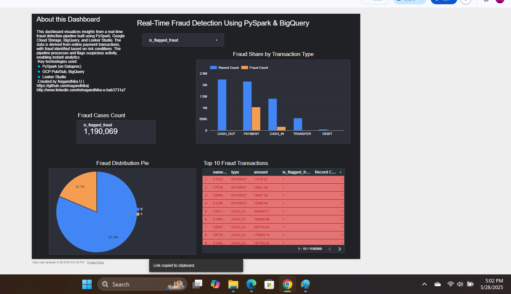

# Real-Time Fraud Detection Pipeline using PySpark & Google Cloud Platform

This project simulates a real-time fraud detection system for financial transactions using PySpark on GCP (Dataproc), BigQuery, and Looker Studio. It processes streaming-like data, applies rule-based fraud logic, and visualizes key insights in an interactive dashboard.

## 🔧 Tech Stack

- Google Cloud Platform (GCP)
  - Cloud Storage
  - Pub/Sub
  - Dataproc (PySpark)
  - BigQuery
- Python & PySpark
- Looker Studio (for dashboarding)
- Kaggle Financial Transaction Dataset

## 🗺️ Architecture Overview

## 🔄 Pipeline Workflow

1. Upload CSV transaction data to Cloud Storage.
2. Stream records into Pub/Sub (simulated with a Python script).
3. Process records using PySpark on Dataproc.
4. Apply fraud detection logic.
5. Write processed data to BigQuery.
6. Build interactive fraud insights dashboard using Looker Studio.

## 🚨 Fraud Logic

A transaction is flagged as fraud if:
- Amount > 10,000
- Destination account had a zero balance before and after the transaction

This logic is implemented in `fraud_detection.py` using PySpark.

## 📸 Dashboard Screenshots

## 🔗 Live Demo

- 📊 [Looker Studio Dashboard](https://lookerstudio.google.com/reporting/ffd902ba-7579-4e2b-99d6-29b148921fdd)
- 💻 [Dataset on Kaggle](https://www.kaggle.com/datasets/jainilcoder/online-payment-fraud-detection?resource=download)

## 🚀 How to Run This Project

1. Clone this repo.
2. Upload dataset to Cloud Storage.
3. Create a Pub/Sub topic and Dataproc cluster.
4. Run the `stream_to_pubsub.py` script from Cloud Shell.
5. Submit `fraud_detection.py` job to Dataproc.
6. Explore results in BigQuery.
7. Connect Looker Studio to BigQuery to build dashboards.

## 👤 Author

**Nagandhika U**  
- [LinkedIn](http://www.linkedin.com/in/nagandhika-u-bab3731a7)  
- [GitHub](https://github.com/nagandhika)
